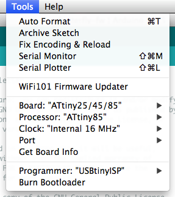

This is the firmware for my [butterfly nightlight][1].

You'll need to install the [Arduino IDE][2], the
[Adafruit NeoPixel library][3], and support for the
[ATtiny microcontroller][4].  The version of the ATtiny support for
the Arduino 1.6.x IDE also seems to work fine with Arduino IDE 1.8.5.

I recommend using the [Tiny AVR Programmer][5] from SparkFun, but it
theory, any AVR programmer should work, if it's hooked up properly.

In the "Tools" menu, "Board" should be set to "ATtiny", "Processor"
should be set to "ATtiny85", and "Clock" should be set to "8 MHz
(internal)".  If using the Tiny AVR Programmer, then "Programmer"
should be set to "USBtinyISP".

After setting the above settings, and before uploading the sketch, be
sure to run "Burn Bootloader" from the "Tools" menu.  In the case of
the ATtiny, this does not actually burn a bootloader.  Instead, it
just burns the fuses.  This is necessary to get the ATtiny85 to run at
8 MHz.  This only needs to be done once per chip; it does not need to
be done every time you upload a sketch.

[1]: https://github.com/ppelleti/butterfly-hw
[2]: https://www.arduino.cc/en/Main/Software
[3]: https://github.com/adafruit/Adafruit_NeoPixel
[4]: https://github.com/damellis/attiny
[5]: https://www.sparkfun.com/products/11801
